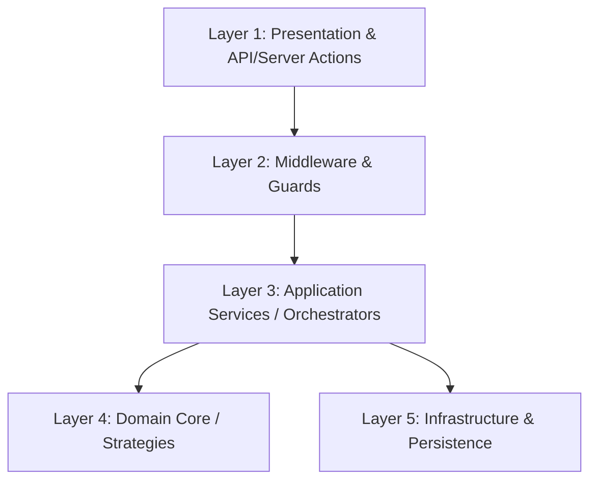
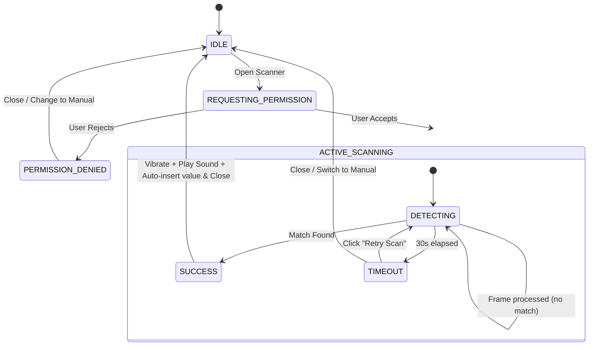

# Unified Optimization and Security Implementation Plan: Design Specification

This document synthesizes and unifies the technical designs from all specialization subagents (System Architect, Database Expert, Security Specialist, UX Specialist, Process & Performance Documenter, and Backup & Recovery Expert) into a single, cohesive blueprint for upgrading the ElitePass POS (`elitepass-pos`) and Club Administrator/Reservations (`club-administrator` / `elitepass-reservas`) modules.

---

## 1. System Architecture & Code Layer Segregation

To ensure maintainability, testing, and independent scalability of the new features, a strict **5-layer architectural segregation** is enforced across all updated services:



### Layer 1: Presentation & API/Server Actions
*   **Responsibilities:** Render UI elements (e.g., Turnstile widgets, inventory grids); parse and validate incoming payloads; route to backend handlers.
*   **Rules:** Zero direct database access. No business rules logic. Strictly handles HTTP requests/responses or Next.js Server Action inputs.

### Layer 2: Middleware & Guards
*   **Responsibilities:** Cross-cutting security concerns (Authentication via SSO, CSRF protection, Nginx/Redis Rate Limiting, Turnstile validation).
*   **Rules:** Blocks unauthorized/bot requests before application services are executed.

### Layer 3: Application Services / Orchestrators
*   **Responsibilities:** Coordinate workflows. Inject appropriate strategies, run transactions, call external APIs, and dispatch notifications.
*   **Examples:** `ReservationService` (locks and registers bookings), `InventoryService` (manages FIFO/FEFO stock adjustments).

### Layer 4: Domain Core / Strategies
*   **Responsibilities:** Pure business logic (e.g., FIFO queueing algorithm, unit packaging converters, expiration checks).
*   **Rules:** Must be **framework-agnostic** and **database-agnostic**. No Prisma imports, no Redis imports. Accepts pure objects/interfaces and returns result structures.

### Layer 5: Infrastructure & Persistence
*   **Responsibilities:** DB communication (Prisma), Cache/Memory Store access (Redis client), Cloud Storage (Azure Blob SDK), HTTP clients for Turnstile siteverify.
*   **Rules:** Implements interfaces defined by the Application Services.

---

## 2. Concurrency Control: Redis-Based Distributed Locking

Currently, ElitePass uses a PostgreSQL table `ReservationLock` to prevent double-booking of tables or tickets. Under peak concurrency (e.g., ticket release at 8 PM), concurrent database write locks degrade query performance. In-memory locking with Redis offers sub-millisecond check-and-set latencies.

### 2.1 Multi-Tenant Lock Key Structure
To guarantee tenant isolation, all locks are namespaced with the tenant's `empresaId`:
```
tenant:{empresaId}:lock:{lockType}:{resourceId}
```
*   **VIP Table 12:** `tenant:empresa_abc:lock:table:12`
*   **Ticket Category "General":** `tenant:empresa_abc:lock:ticket_cat:general`

### 2.2 Locking Algorithm
*   **Acquisition:** Atomic check-and-set using Redis `SET key value NX PX milliseconds`.
    *   **NX:** Set the key only if it does not already exist.
    *   **PX:** Expire the key after a configured TTL (e.g., 300,000 ms / 5 minutes) to prevent deadlocks if a client crashes.
    *   **Value:** A unique UUID generated by the requesting client to prevent accidental release.
*   **Release:** Handled via an atomic Lua script comparing the lock value (uuid generated by the locking client) before deleting:
    ```lua
    if redis.call("get", KEYS[1]) == ARGV[1] then
        return redis.call("del", KEYS[1])
    else
        return 0
    end
    ```

### 2.3 Resiliency & Postgres Fallback (Circuit Breaker)
*   If the Redis service goes offline completely:
    *   The Redis client wrapper catches the error event, sets `unavailable = true`, and returns `null`.
    *   Core services fall back to the PostgreSQL database table (`ReservationLock`) as a fallback transaction path.
    *   Setting `USE_REDIS_LOCKS=false` in environment variables disables Redis locking entirely.

---

## 3. Database Schema Extensions & Backwards-Compatibility

To upgrade `elitepass-pos` and `elitepass-reservas` without breaking existing database tables, we introduce new models as non-breaking extensions. These models establish relations to existing structures (`Producto`, `Empresa`, `Proveedor`, `Evento`, `MovimientoStock`).

### 3.1 FIFO/FEFO Batch Tracking (POS System)
We add `LoteProducto` (to track stock batches with expiration dates and individual costs) and `KardexLote` (an immutable ledger linking stock movements to specific batches).

```prisma
// Inside schema.prisma

model LoteProducto {
  id               String       @id @default(cuid())
  empresaId        String       @map("empresa_id")
  eventoId         String?      @map("evento_id")
  productoId       String       @map("producto_id")
  codigoLote       String       @map("codigo_lote")      // e.g. "LOT-2026-06-A"
  cantidadOriginal Float        @map("cantidad_original") // Initial amount in base units
  cantidadRestante Float        @map("cantidad_restante") // Current remaining amount in base units
  costoUnitario    Float        @map("costo_unitario")    // Unit cost at ingestion
  fechaExpiracion  DateTime?    @map("fecha_expiracion")
  fechaIngreso     DateTime     @default(now()) @map("fecha_ingreso")
  creadoEn         DateTime     @default(now()) @map("creado_en")
  actualizadoEn    DateTime     @updatedAt @map("actualizado_en")

  // Relations
  empresa          Empresa      @relation(fields: [empresaId], references: [id], onDelete: Cascade)
  evento           Evento?      @relation(fields: [eventoId], references: [id], onDelete: SetNull)
  producto         Producto     @relation(fields: [productoId], references: [id], onDelete: Cascade)
  movimientosLote  KardexLote[]

  @@unique([empresaId, productoId, codigoLote])
  @@index([empresaId, productoId, fechaExpiracion])
  @@index([empresaId, productoId, fechaIngreso])
  @@index([eventoId])
  @@map("lotes_producto")
}

model KardexLote {
  id                String          @id @default(cuid())
  loteId            String          @map("lote_id")
  movimientoStockId String?         @map("movimiento_stock_id")
  cantidad          Float           // Negative for consumption, positive for additions
  creadoEn          DateTime        @default(now()) @map("creado_en")

  // Relations
  lote              LoteProducto    @relation(fields: [loteId], references: [id], onDelete: Cascade)
  movimientoStock   MovimientoStock? @relation(fields: [movimientoStockId], references: [id], onDelete: Cascade)

  @@index([loteId])
  @@index([movimientoStockId])
  @@map("kardex_lotes")
}
```

### 3.2 Supplier Packaging Mappings
To map vendor packaging sizes (e.g., box of 12 bottles, 50L keg) and auto-convert them to base inventory units, we introduce the `SupplierProduct` mapping table:

```prisma
model SupplierProduct {
  id              String   @id @default(cuid())
  empresaId       String   @map("empresa_id")
  proveedorId     String   @map("proveedor_id")
  productoId      String   @map("producto_id")
  skuProveedor    String   @map("sku_proveedor")      // Vendor SKU code
  precioCompra    Float    @map("precio_compra")      // Cost per package unit
  unidadEmbalaje  String   @map("unidad_embalaje")    // e.g. "CAJA", "BARRIL", "PACK_6"
  ratioConversion Float    @map("ratio_conversion")   // Factor to convert packaging to base unit (e.g. 12.0)
  creadoEn        DateTime @default(now()) @map("creado_en")
  actualizadoEn   DateTime @updatedAt @map("actualizado_en")

  // Relations
  empresa         Empresa   @relation(fields: [empresaId], references: [id], onDelete: Cascade)
  proveedor       Proveedor @relation(fields: [proveedor_id], references: [id], onDelete: Cascade)
  producto        Producto  @relation(fields: [producto_id], references: [id], onDelete: Cascade)

  @@unique([empresaId, proveedorId, skuProveedor])
  @@index([empresaId, productoId])
  @@map("supplier_products")
}
```

#### Required Back-Relations in Existing Models:
```prisma
// Inside model Empresa:
// lotesProducto     LoteProducto[]
// supplierProducts  SupplierProduct[]

// Inside model Producto:
// lotesProducto     LoteProducto[]
// supplierProducts  SupplierProduct[]

// Inside model Proveedor:
// supplierProducts  SupplierProduct[]

// Inside model Evento:
// lotesProducto     LoteProducto[]

// Inside model MovimientoStock:
// movementsLote      KardexLote[]
```

---

## 4. Batch & FIFO/FEFO Inventory Strategy

### 4.1 Consumption Strategy Pattern
An interface `IInventoryConsumptionStrategy` is implemented by two domain strategies:
*   **FIFO (First-In, First-Out):** Queries active `LoteProducto` rows, sorted by `fechaIngreso ASC`.
*   **FEFO (First-Expired, First-Out):** Filters out expired lots, querying active `LoteProducto` rows sorted by `fechaExpiracion ASC` (with null values sorted last or treated as standard FIFO).

### 4.2 Packaging Mapping & Conversions
*   **Domain Layer:** A `PackagingConverter` maps:
    `BaseStockUnits = PurchasedQuantity * ratioConversion`
*   **Application Layer:** When registering a purchase from a supplier:
    1. Retrieve `SupplierProduct` mapping.
    2. If found, automatically translate the units and cost.
    3. Create the `LoteProducto` using the translated base units and converted unit cost.

### 4.3 Database Synchronization & Reconciliation
*   Legacy tables (`StockAlmacen` and `StockBarra`) continue to store aggregate totals for backwards compatibility.
*   A background reconciliation script compares `Producto.stock` with `SUM(LoteProducto.cantidadRestante)` per product, logging details on any drift.

---

## 5. API Security & Bot Mitigation

### 5.1 Sliding Window Rate Limiting (Redis ZSET)
*   **Structure:** Evaluates the exact number of requests made in the rolling window relative to the current millisecond.
*   **Redis Implementation:** Uses a Sorted Set (ZSET) per user/IP/endpoint with key `rl:sw:{endpoint}:{ip}`.
*   **Atomic Lua Script:**
    ```lua
    local key = KEYS[1]
    local now = tonumber(ARGV[1])
    local windowMs = tonumber(ARGV[2])
    local limit = tonumber(ARGV[3])
    local memberId = ARGV[4]

    local clearBefore = now - windowMs
    redis.call('zremrangebyscore', key, '-inf', clearBefore)
    local currentRequests = redis.call('zcard', key)

    if currentRequests < limit then
        redis.call('zadd', key, now, memberId)
        redis.call('expire', key, math.ceil(windowMs / 1000))
        return {1, limit - currentRequests - 1} -- {allowed, remaining}
    else
        return {0, 0} -- {blocked, remaining}
    end
    ```

### 5.2 Cloudflare Turnstile Verification
*   **Server Actions Integration:** Verification is decoupled from the business logic by wrapping Server Actions with a decorator `withTurnstileProtection(actionFn)`.
*   **Validation Method:** Reads the token from headers or parameters and verifies it against the Cloudflare siteverify endpoint. Includes client IP (e.g., `cf-connecting-ip`) for security validation.
*   **Fallback Policy:** If the Turnstile API times out or returns a 5xx error, the system validates the client's cryptographically signed telemetry payload. If the telemetry appears safe, the request is allowed to pass, logging warnings for audit purposes.

### 5.3 Headless Browser Mitigation
*   **Header Consistency Validation:** Middleware intercepts requests to evaluate Client Hints (`sec-ch-ua`), User-Agent keywords, and headers that automated tools often omit (e.g., `accept-language`).
*   **Client-Side Telemetry:** Evaluates properties like `navigator.webdriver === true`, missing plugins, and WebGL rendering anomalies. The results are encrypted into a client signature submitted with critical transactions.

---

## 6. UX/UI Upgrades & Client-Side Feedback

### 6.1 Client-Side Barcode & QR Scanning
*   **Core Library:** Dynamic import of `html5-qrcode` or native `BarcodeDetector` (where supported) to minimize bundle sizes.
*   **Hardware and Feedback:**
    *   Uses `navigator.mediaDevices.getUserMedia` for video stream access.
    *   Flashlight/torch toggle control.
    *   Immediate audio feedback using synthesized Web Audio API (an oscillator generating a `1200Hz` sine wave for `80ms`) to avoid downloading external asset files.
    *   Haptic feedback via `navigator.vibrate([100])` on successful match.
*   **State Machine:**


### 6.2 Hierarchical POS Category Selector
*   **Data Modeling:** Self-referential Prisma parent-child category relationship.
*   **Zustand State Store:**
    *   `activeCategoryId: string | null`
    *   `historyStack: string[]`
    *   `searchQuery: string`
*   **Interface Structure:** Breadcrumb navigation trail, folding folder grid layout for subcategories, and fluid product layout cards.

### 6.3 Turnstile CAPTCHA State Feedback
*   **Background Pre-Verification:** Instantiates Turnstile in invisible or compact mode at form mount. Since verification takes ~1.5s and filling fields takes >15s, validation is complete before form submission.
*   **Visual States (OKLCH System):**
    *   `INITIALIZING` (Gray / disabled button): Script is booting.
    *   `VERIFYING` (Amber / disabled button): Verification running in background.
    *   `VERIFIED` (Emerald / enabled button): Token acquired, active success feedback.
    *   `FAILED` (Red / disabled button + error banner): Manual retry button displayed.

---

## 7. Performance Latency Benchmarks, Load Testing & KPIs

### 7.1 Latency Benchmarks (Redis vs. Postgres)

| Metric | Redis Distributed Lock (Redlock) | Postgres Row Lock (`SELECT FOR UPDATE`) |
| :--- | :--- | :--- |
| **Lock Acquisition Target** | < 5 ms | < 50 ms |
| **Max Wait Timeout** | 500 ms (fail-fast) | 2000 ms (before database timeout) |
| **Usage Scenario** | Rate limiting, endpoint debounce, token validation. | Table allocation, inventory batch decrement. |
| **Fail-safe Behavior** | Bypass and log; fallback to DB rate limits. | Transaction rollback, return `409 Conflict`. |

### 7.2 Core Web Vitals
*   **First Contentful Paint (FCP):** < 1.2s
*   **Largest Contentful Paint (LCP):** < 2.5s
*   **Total Blocking Time (TBT):** < 200ms
*   **Cumulative Layout Shift (CLS):** < 0.1
*   **Page Hydration Time:** < 300ms (POS Login: < 50ms)

### 7.3 Load Testing Configurations
*   **Gate Check-in (k6):** Targets 500 concurrent users with a P95 response time under 200ms and an error rate under 1% for `/api/qr/verify`.
*   **POS Orders (Autocannon):** Benchmarks POS checkout endpoints with 100 concurrent checkout connections over 30 seconds.

---

## 8. Connection Pooling & Database Tuning

### 8.1 PgBouncer Configuration
PgBouncer is configured on port `6432` in `transaction` mode to maximize connection reuse:
```ini
[pgbouncer]
pool_mode = transaction
max_client_conn = 10000
default_pool_size = 150
min_pool_size = 30
reserve_pool_size = 50
reserve_pool_timeout = 2
max_db_connections = 250
client_login_timeout = 5
server_idle_timeout = 120
query_timeout = 10
```
*   *Prisma settings:* Append `?pgbouncer=true` to connection strings in `.env`.

### 8.2 PostgreSQL Level Settings
```sql
ALTER DATABASE elitepass_prod SET statement_timeout = '10s';
ALTER DATABASE elitepass_prod SET idle_in_transaction_session_timeout = '5s';
```
Ensure indexes on foreign keys (`eventId`, `tableId`, `productoId`, `loteId`) to prevent pool starvation.

---

## 9. Backup, Recovery & Rollback Plan

### 9.1 Pre-Migration Backup Flow
1.  **Connection String Port Bypass:** Direct pg_dump to port `5432` instead of PgBouncer `6432`.
2.  **Snapshot Consistency:** Run `pg_dump` with `--serializable-deferrable` and `--format=custom` (`-Fc`) to prevent lock contention and enable fast selective recovery.
3.  **Direct Streaming to Storage:** Stream the backup stdout to Azure Blob Storage with write-once immutable storage policies.

### 9.2 Database Migration Failures & Resolution
1.  Mark failed migrations as rolled back:
    ```bash
    pnpm prisma migrate resolve --rolled-back "YYYYMMDDHHMMSS_failed_migration_name"
    ```
2.  Apply corresponding `rollback.sql` containing the DDL/DML drop script.
3.  For catastrophic failures, run a complete restore:
    ```bash
    pg_restore -h 127.0.0.1 -p 5432 -U postgres --dbname=jet_club_db --clean --if-exists /tmp/pre-migration-snapshot.dump
    ```

### 9.3 Multi-Tenant Backup Isolation
*   **Export:** Logical serialization of single-tenant records matching `empresaId` to compressed JSON payload (`.json.gz`).
*   **Selective Restore:**
    1.  Execute in a database transaction.
    2.  Delete existing records matching `empresaId` in reverse dependency order.
    3.  Load JSON backup records in dependency order.
    4.  Verify integrity and commit.

### 9.4 Redis Persistence
*   **Hybrid Mode:** Enable AOF (Append-Only File) synced `everysec` and RDB Snapshotting.
*   **Orphaned Lock Flush:** Execute a script to scan and delete active locks (`lock:*`) on boot while keeping user session cache keys intact.
