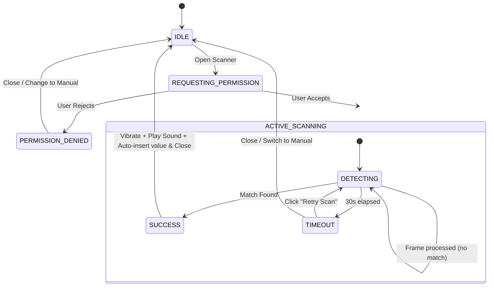

# Technical Design: ElitePass UI/UX Upgrades (POS & Reservations)

This document details the visual structure, state machines, and interaction flows for the barcode scanning, category navigation, and Turnstile CAPTCHA feedback upgrades.

---

## 1. Client-Side Barcode Scanning Integration (POS)

### Architecture & APIs
- **Core Library:** Dynamic import of `html5-qrcode` or utilization of the native browser `BarcodeDetector` API (where supported) to minimize bundle sizes.
- **Hardware Integration:**
  - `navigator.mediaDevices.getUserMedia` for video stream access.
  - Video track manipulation for torch/flashlight toggle (`track.applyConstraints({ advanced: [{ torch: true }] })`).
  - `navigator.vibrate([100])` for instant physical feedback upon success.
- **Audio Feedback:** Synthesized via Web Audio API (an oscillator generating a `1200Hz` sine wave for `80ms`) to avoid downloading external audio assets.

### State Machine (States & Transitions)



### Component Blueprint (UI Structure)

```tsx
interface BarcodeScannerOverlayProps {
  onScanSuccess: (barcode: string) => void;
  onClose: () => void;
}

export function BarcodeScannerOverlay({ onScanSuccess, onClose }: BarcodeScannerOverlayProps) {
  const [hasTorch, setHasTorch] = useState(false);
  const [torchOn, setTorchOn] = useState(false);
  const [errorMsg, setErrorMsg] = useState<string | null>(null);

  // Initialized dynamically upon mount to support lazy loading
  return (
    <div className="fixed inset-0 z-50 flex flex-col bg-zinc-950/90 text-zinc-50 backdrop-blur-sm animate-fade-in">
      {/* Header Controls */}
      <header className="flex items-center justify-between p-4 border-b border-zinc-800">
        <h3 className="text-lg font-medium font-sans">Escanear Código de Barras</h3>
        <button onClick={onClose} className="p-2 hover:bg-zinc-800 rounded-lg transition-colors">
          <span className="material-symbols-outlined">close</span>
        </button>
      </header>

      {/* Camera Feed & Scanner Overlay Container */}
      <div className="relative flex-1 flex items-center justify-center overflow-hidden">
        {/* Scanner HTML Video Feed Target */}
        <div id="reader" className="absolute inset-0 w-full h-full object-cover" />

        {/* CSS Scanner Overlay Overlay Box */}
        <div className="absolute inset-0 pointer-events-none flex flex-col justify-between">
          <div className="bg-zinc-950/60 h-1/4 w-full" />
          <div className="flex h-2/4 w-full">
            <div className="bg-zinc-950/60 w-1/12 md:w-3/12 h-full" />
            
            {/* Active Scan Reticle */}
            <div className="relative w-10/12 md:w-6/12 h-full border-2 border-dashed border-zinc-500 rounded-lg flex items-center justify-center">
              {/* Laser line animation */}
              <div className="absolute w-full h-0.5 bg-red-500 shadow-[0_0_8px_#ef4444] top-0 animate-laser-sweep" />
              
              {/* Corner Indicators */}
              <div className="absolute top-0 left-0 w-6 h-6 border-t-4 border-l-4 border-white -mt-1 -ml-1 rounded-tl-sm" />
              <div className="absolute top-0 right-0 w-6 h-6 border-t-4 border-r-4 border-white -mt-1 -mr-1 rounded-tr-sm" />
              <div className="absolute bottom-0 left-0 w-6 h-6 border-b-4 border-l-4 border-white -mb-1 -ml-1 rounded-bl-sm" />
              <div className="absolute bottom-0 right-0 w-6 h-6 border-b-4 border-r-4 border-white -mb-1 -mr-1 rounded-br-sm" />
            </div>
            
            <div className="bg-zinc-950/60 w-1/12 md:w-3/12 h-full" />
          </div>
          <div className="bg-zinc-950/60 h-1/4 w-full flex flex-col items-center justify-center p-4">
            <p className="text-zinc-400 text-sm mb-2 text-center">
              Coloque el código de barras dentro del recuadro
            </p>
          </div>
        </div>

        {/* Permission / Loading States */}
        {errorMsg && (
          <div className="absolute inset-0 bg-zinc-900/95 flex flex-col items-center justify-center p-6 text-center z-10">
            <span className="material-symbols-outlined text-red-500 text-4xl mb-4">videocam_off</span>
            <h4 className="text-lg font-semibold mb-2">Permiso de cámara denegado</h4>
            <p className="text-zinc-400 text-sm max-w-xs mb-6">
              Para escanear códigos de barras, por favor habilite el acceso a la cámara en la configuración de su navegador.
            </p>
            <button onClick={onClose} className="px-4 py-2 bg-zinc-800 text-white rounded-lg hover:bg-zinc-700 transition-colors font-medium">
              Volver al ingreso manual
            </button>
          </div>
        )}
      </div>

      {/* Floating Scan controls */}
      <footer className="p-6 border-t border-zinc-800 bg-zinc-900 flex justify-around items-center">
        {hasTorch && (
          <button 
            onClick={() => setTorchOn(!torchOn)} 
            className={`p-3 rounded-full transition-all ${torchOn ? "bg-amber-500 text-zinc-950" : "bg-zinc-800 text-zinc-300 hover:bg-zinc-700"}`}
          >
            <span className="material-symbols-outlined">
              {torchOn ? "flashlight_on" : "flashlight_off"}
            </span>
          </button>
        )}
        <button 
          onClick={onClose} 
          className="px-6 py-3 bg-zinc-800 text-zinc-200 hover:bg-zinc-700 rounded-lg transition-colors font-medium flex items-center gap-2"
        >
          <span className="material-symbols-outlined text-base">keyboard</span>
          Ingreso Manual
        </button>
      </footer>
    </div>
  );
}
```

---

## 2. Interactive Category & Subcategory Selection (POS Grid)

### Data Modeling & State Management
Categories are structured hierarchically (self-referencing parent-child relationship).
- **Prisma Entity Example:**
  ```prisma
  model Category {
    id          String     @id @default(uuid())
    name        String
    parentId    String?    // Self-relation
    parent      Category?  @relation("SubCategories", fields: [parentId], references: [id])
    subCategories Category[] @relation("SubCategories")
    products    Product[]
  }
  ```
- **Zustand State:**
  - `activeCategoryId: string | null` (if null, display top-level categories).
  - `historyStack: string[]` (array of visited category IDs for back navigation).
  - `searchQuery: string` (resets category filter if active, showing direct search results instead).

### Grid Component Blueprint

```tsx
export function POSCategoryGrid() {
  const { 
    categories, // Flat array of all categories loaded
    activeCategoryId,
    historyStack,
    setCategory,
    goBackCategory,
    resetCategory
  } = usePOSStore();

  // Filter current subcategories & products
  const currentCategories = categories.filter(c => c.parentId === activeCategoryId);
  const activeCategory = categories.find(c => c.id === activeCategoryId);

  return (
    <div className="flex flex-col h-full bg-zinc-50 border-r border-zinc-200 font-sans">
      {/* Category Navigation Header */}
      <div className="p-4 bg-white border-b border-zinc-100 flex flex-col gap-3">
        {/* Breadcrumb Path */}
        <div className="flex items-center gap-1.5 text-xs text-zinc-500 overflow-x-auto whitespace-nowrap scrollbar-none">
          <button onClick={resetCategory} className="hover:text-zinc-900 transition-colors">
            Todos
          </button>
          {historyStack.map((catId, idx) => {
            const cat = categories.find(c => c.id === catId);
            return (
              <React.Fragment key={catId}>
                <span className="text-zinc-300">/</span>
                <button 
                  onClick={() => setCategory(catId, historyStack.slice(0, idx + 1))}
                  className="hover:text-zinc-900 transition-colors"
                >
                  {cat?.name}
                </button>
              </React.Fragment>
            );
          })}
          {activeCategory && (
            <>
              <span className="text-zinc-300">/</span>
              <span className="font-medium text-zinc-900">{activeCategory.name}</span>
            </>
          )}
        </div>

        {/* Back and Title bar */}
        <div className="flex items-center gap-3">
          {activeCategoryId && (
            <button 
              onClick={goBackCategory} 
              className="p-1.5 hover:bg-zinc-100 rounded-lg transition-colors border border-zinc-200 flex items-center"
            >
              <span className="material-symbols-outlined text-sm">arrow_back</span>
            </button>
          )}
          <h2 className="text-sm font-semibold text-zinc-900">
            {activeCategory ? activeCategory.name : "Categorías"}
          </h2>
        </div>
      </div>

      {/* Grid Content Area */}
      <div className="flex-1 overflow-y-auto p-4 space-y-4">
        {/* Subcategories (Foldered layout at top of grid) */}
        {currentCategories.length > 0 && (
          <div>
            <h3 className="text-xs font-medium text-zinc-400 uppercase tracking-wider mb-2">Subcategorías</h3>
            <div className="grid grid-cols-2 sm:grid-cols-3 gap-2">
              {currentCategories.map(cat => (
                <button
                  key={cat.id}
                  onClick={() => setCategory(cat.id)}
                  className="flex items-center justify-between p-3 bg-white hover:bg-zinc-50 border border-zinc-200 rounded-[10px] text-left transition-all active:scale-[0.98] shadow-sm"
                >
                  <div className="flex items-center gap-2 overflow-hidden">
                    <span className="material-symbols-outlined text-amber-500 fill-amber-500 text-lg">folder</span>
                    <span className="text-sm font-medium text-zinc-800 truncate">{cat.name}</span>
                  </div>
                  <span className="material-symbols-outlined text-zinc-400 text-sm">chevron_right</span>
                </button>
              ))}
            </div>
          </div>
        )}

        {/* Product Cards Grid */}
        <div>
          <h3 className="text-xs font-medium text-zinc-400 uppercase tracking-wider mb-2">Productos</h3>
          {/* Active category products go here */}
          <div className="grid grid-cols-2 md:grid-cols-3 lg:grid-cols-4 gap-3">
            {/* ProductCard list */}
          </div>
        </div>
      </div>
    </div>
  );
}
```

---

## 3. Turnstile CAPTCHA State Feedback (Reservations)

### Background Pre-Verification Strategy
To guarantee a **0ms perceived latency**:
1. **Script Async Loading:** Cloudflare Turnstile's JS SDK is loaded with `async defer` in the layout or root of the public registration form segment.
2. **Immediate Initialization:** The Turnstile widget is instantiated in `invisible` or `compact` mode at the bottom of the page, initializing *immediately* when the client opens the registration page.
3. **Coinciding Lifecycle:** Since verification takes between `1.2s` and `2.0s`, and filling out name, phone, and CI fields takes an average of `15s` to `30s`, verification completes in the background long before the user reaches the submission phase.

### Visual State Mapping (OKLCH System)

| State | CSS Tokens | Submit Button State | Action / Description |
|---|---|---|---|
| **INITIALIZING** | `text-zinc-400` | Disabled ("Cargando verificación...") | Script is booting up. |
| **VERIFYING** | `text-amber-600 bg-amber-50 border-amber-200` | Submits only on resolution ("Verificando seguridad...") | Active verification running. Non-blocking to user input. |
| **VERIFIED** | `text-emerald-700 bg-emerald-50 border-emerald-200` | Enabled ("Registrar Entrada") | Token received and set in state. Active success feedback. |
| **FAILED** | `text-red-700 bg-red-50 border-red-200` | Disabled ("Error de verificación") | Action blocked. Triggers visual error banner and "Reintentar" button. |

### Component Blueprint (UI Form Segment)

```tsx
import Turnstile, { useTurnstile } from "react-turnstile";

export function PublicRegistrationForm({ formId }) {
  const [captchaState, setCaptchaState] = useState<"INIT" | "VERIFYING" | "VERIFIED" | "FAILED">("INIT");
  const [captchaToken, setCaptchaToken] = useState<string | null>(null);
  const turnstile = useTurnstile();

  const handleVerify = (token: string) => {
    setCaptchaToken(token);
    setCaptchaState("VERIFIED");
    toast.success("Seguridad verificada con éxito", { duration: 1500 });
  };

  const handleError = () => {
    setCaptchaState("FAILED");
    setCaptchaToken(null);
    toast.error("Fallo la verificación de seguridad");
  };

  const handleReset = () => {
    setCaptchaState("VERIFYING");
    if (turnstile) turnstile.reset();
  };

  return (
    <form className="space-y-6">
      {/* Standard Fields here: CI, Nombre, etc. */}
      
      {/* Hidden Turnstile Widget */}
      <div className="hidden">
        <Turnstile
          sitekey={process.env.NEXT_PUBLIC_TURNSTILE_SITE_KEY!}
          onVerify={handleVerify}
          onError={handleError}
          onExpire={() => setCaptchaState("FAILED")}
          options={{ theme: "light", size: "invisible" }}
        />
      </div>

      {/* Visual Feedback Banner & Action Panel */}
      <div className="rounded-[10px] border p-4 bg-zinc-50 border-zinc-200 flex flex-col gap-3 transition-all duration-300">
        <div className="flex items-center justify-between">
          <div className="flex items-center gap-2.5">
            {/* Dynamic Status Icon */}
            {captchaState === "INIT" && (
              <span className="material-symbols-outlined animate-spin text-zinc-400">progress_activity</span>
            )}
            {captchaState === "VERIFYING" && (
              <span className="material-symbols-outlined animate-spin text-amber-500">progress_activity</span>
            )}
            {captchaState === "VERIFIED" && (
              <span className="material-symbols-outlined text-emerald-600 font-bold">check_circle</span>
            )}
            {captchaState === "FAILED" && (
              <span className="material-symbols-outlined text-red-600 font-bold">error</span>
            )}

            {/* Dynamic Status Text */}
            <div className="flex flex-col">
              <span className="text-xs font-semibold text-zinc-800">
                {captchaState === "INIT" && "Iniciando protección contra bots..."}
                {captchaState === "VERIFYING" && "Verificando seguridad de sesión..."}
                {captchaState === "VERIFIED" && "Sesión segura verificada"}
                {captchaState === "FAILED" && "Error de verificación anti-bot"}
              </span>
              <span className="text-[10px] text-zinc-400">
                Protegido por Cloudflare Turnstile
              </span>
            </div>
          </div>

          {/* Reset Action (Visible only on failure) */}
          {captchaState === "FAILED" && (
            <button
              type="button"
              onClick={handleReset}
              className="px-2.5 py-1 text-xs bg-red-100 hover:bg-red-200 border border-red-300 text-red-800 rounded-md transition-all font-medium flex items-center gap-1"
            >
              <span className="material-symbols-outlined text-xs">sync</span> Reintentar
            </button>
          )}
        </div>
      </div>

      {/* Main Submit Button */}
      <Button
        type="submit"
        disabled={captchaState !== "VERIFIED" || isPending}
        className="w-full h-12 rounded-[10px] font-sans font-semibold flex items-center justify-center gap-2"
      >
        {isPending && <Loader2 className="h-4 w-4 animate-spin" />}
        {captchaState === "VERIFIED" ? "Completar Registro" : "Esperando verificación..."}
      </Button>
    </form>
  );
}
```
