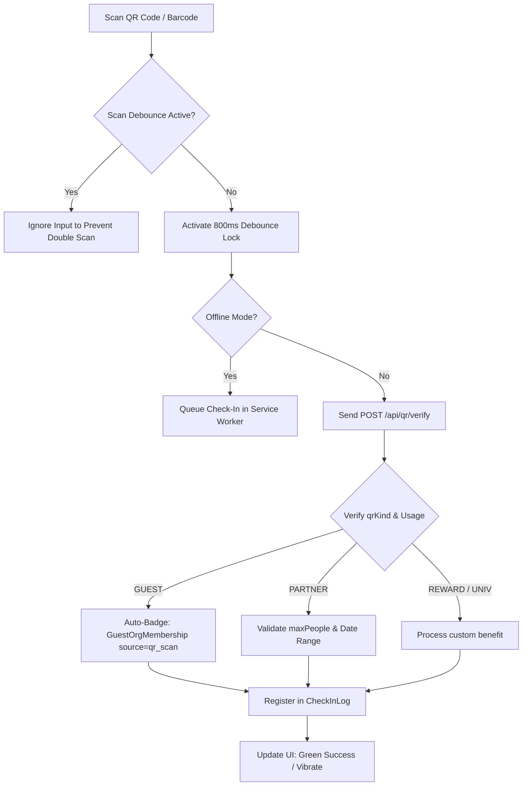
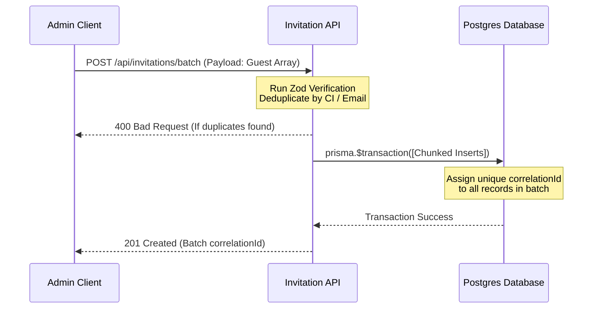
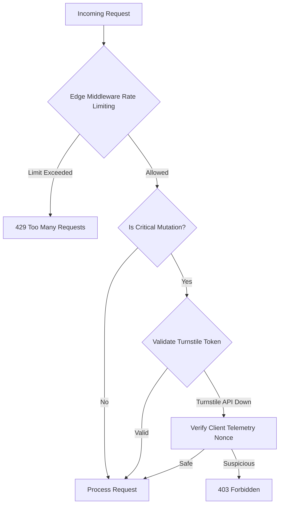

# Technical Design: Operational Workflows, Performance Latency Benchmarks, and Success KPIs

This document specifies the technical design, architectural guidelines, and latency goals for ElitePass's core modules, specifically focusing on POS, Reservas, and Identity.

---

## 1. Operational Workflows & SOPs

### A. Scanning Barcodes & QR (Front-Gate Ticket Validation)



#### Step-by-Step SOP for Gate Operators:
1. **Prepare Device**: Open the ElitePass Reservas check-in portal. Ensure camera permissions are granted.
2. **Select Scan Mode**:
   - **Standard Check-In**: Uses the `QREntry` model for individual guest or reward tickets.
   - **VIP Group Check-In**: Uses the `PackageReservationGuest.checkedIn = true` flag. Operators must view the group manifest and check in members by name. *Do not mix individual QREntry with PackageReservationGuest.*
3. **Scan Execution**: Align the QR code with the on-screen viewfinder.
   - The scanning software applies an **800ms debounce interval** to ignore duplicate trigger events.
   - On successful read, the client sends a `POST` request to `/api/qr/verify` with headers `x-csrf-check: 1`.
4. **Offline Fallback**: If internet connectivity is interrupted:
   - The Service Worker caches the scans in IndexDB.
   - The UI alerts the operator: "Offline Mode Active - Scans Queued."
   - Once connection is restored, the queue syncs sequentially to prevent concurrency violations.

---

### B. Managing Batches (Massive Invitation Dispatch)



#### Step-by-Step SOP for Admins:
1. **Upload CSV/Excel**: Navigate to the Administrative Dashboard -> Invitations -> Batch Upload.
2. **Deduplication Check**:
   - The application parses the list and executes a Zod schema refinement `.refine()` to check for duplicate Document Numbers (CI) or emails within the uploaded array.
   - Any duplicates are flagged immediately, prompting the admin to correct them before submission.
3. **Database Insertion**:
   - The backend groups the records under a single `correlationId` (UUIDv4) and processes them in chunk sizes of 100 in a `prisma.$transaction`. This prevents long-lived transaction locks.

---

### C. Cloudflare Turnstile Fallback & Edge Rate Limiting



#### Technical Fallback Rules:
1. **Redis Down Fallback**: If the Redis sliding-window rate limiter drops offline, the Edge Middleware catches the connection exception and falls back to:
   ```typescript
   globalThis.__edgeRateLimitStore // In-memory rate limiting map
   ```
2. **Turnstile Down Fallback**: If the Cloudflare verification service (`challenges.cloudflare.com`) times out or returns a 5xx code:
   - The Server Action checks the client's cryptographically signed telemetry payload (checking variables like `navigator.webdriver !== true` and verified CSS render dimensions).
   - If telemetry is valid, the request proceeds, logging a warning to Zabbix/Telegram.

---

## 2. Performance Latency Benchmarks

### A. Lock Latency Benchmarks (Redis vs. Postgres)

| Metric | Redis Distributed Lock (Redlock) | Postgres Row Lock (`SELECT FOR UPDATE`) |
| :--- | :--- | :--- |
| **Lock Acquisition Target** | < 5 ms | < 50 ms |
| **Max Wait Timeout** | 500 ms (fail-fast) | 2000 ms (before database timeout) |
| **Usage Scenario** | Sliding window rate limiting, active API requests debounce, token validation. | Optimistic mesa/table allocation (`ReservationLock`), inventory decrement (`StockAlmacen`). |
| **Fail-safe Behavior** | Bypass check but log error; fallback to database rate-limits. | Transaction rollback, release pool connection, return `409 Conflict`. |

---

### B. PageSpeed Core Web Vitals & Hydration

To ensure instant UI loading at ticket offices and point of sales:
* **First Contentful Paint (FCP)**: **< 1.2s**
* **Largest Contentful Paint (LCP)**: **< 2.5s**
* **Total Blocking Time (TBT)**: **< 200ms**
* **Cumulative Layout Shift (CLS)**: **< 0.1**
* **Page Hydration Time**: **< 300ms** (static routes like `/` POS login must target **< 50ms**).

*Optimization Strategies:*
* Serve images in WebP format (via sharp utility).
* Use system acromachtic font stacks (Inter, Roboto, Segoe UI) to avoid rendering delays.
* Use React Suspense boundaries (`loading.tsx` skeletons) for streaming page segments.

---

### C. Load Testing Outlines

#### k6 Script Outline (High-Throughput Gate Access)
```javascript
import http from 'k6/http';
import { check, sleep } from 'k6';

export const options = {
  stages: [
    { duration: '1m', target: 100 }, // ramp up
    { duration: '3m', target: 500 }, // peak load (doors open)
    { duration: '1m', target: 0 },   // cool down
  ],
  thresholds: {
    http_req_duration: ['p(95)<200'], // 95% of requests must complete under 200ms
    http_req_failed: ['rate<0.01'],    // Error rate must be less than 1%
  },
};

export default function () {
  const url = 'http://10.0.0.5:3000/api/qr/verify';
  const payload = JSON.stringify({
    qrCode: 'UNIVERSAL:U:cju1234567890123',
    gateId: 'gate_north_01'
  });
  const params = {
    headers: {
      'Content-Type': 'application/json',
      'x-csrf-check': '1',
      'sec-ch-ua': '"Chromium";v="126"',
    },
  };

  const res = http.post(url, payload, params);
  check(res, {
    'status is 200': (r) => r.status === 200,
    'latency OK': (r) => r.timings.duration < 200,
  });
  sleep(0.5); // Scan frequency simulation
}
```

#### Autocannon Script Outline (POS Order Benchmarking)
```javascript
const autocannon = require('autocannon');

const instance = autocannon({
  url: 'http://10.0.0.5:3001/api/v1/ventas',
  connections: 100, // Concurrent POS lanes
  duration: 30,     // seconds
  headers: {
    'content-type': 'application/json',
    'x-csrf-check': '1'
  },
  body: JSON.stringify({
    items: [{ productoId: 'cju897', cantidad: 2, presentacionId: 'cp123' }],
    metodoPago: 'QR_BCP'
  })
}, console.log);

autocannon.track(instance, { renderResultsTable: true });
```

---

## 3. Success Key Performance Indicators (KPIs)

1. **Database Connection Saturation**:
   - *Target*: Active PG connections < **75%** of `max_connections`.
   - PgBouncer configured to pool connections dynamically (VM00).
2. **Page Hydration Time**:
   - *Target*: Average hydration time < **250ms** across all client screens.
3. **API Blockage Rates**:
   - *Target*: Rate-limiting false-positives < **0.1%** for verified, active users.
   - True-positive bot block rate > **99.9%**.
4. **User Check-In Throughput**:
   - *Target*: **50 check-ins/minute** per lane (operator + scanner latency combined).
   - System-wide capacity: **3000 check-ins/hour** without API queue buildup.
