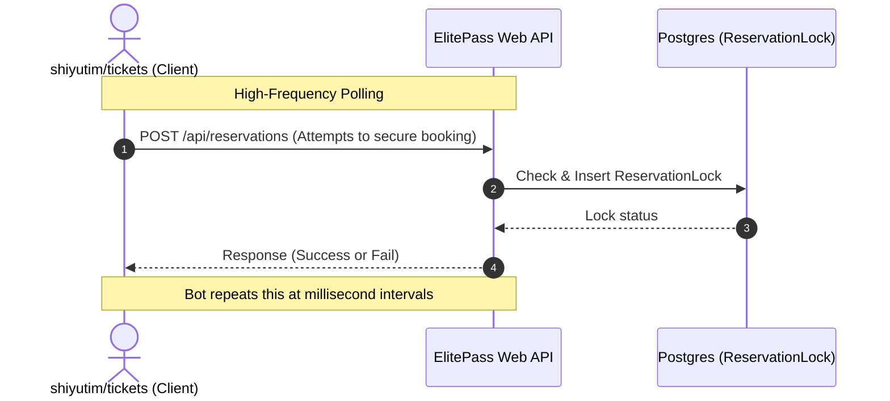

# Design & Technical Comparison: ElitePass Reservas vs. shiyutim/tickets

## Architecture Comparison

| Dimension | ElitePass Reservas | shiyutim/tickets (Bot Client) |
|---|---|---|
| **Tech Stack** | Next.js 15 + Prisma + Better-Auth | Tauri (Rust core) + Vue.js |
| **Runtime Environment** | Serverless / Node.js V8 (hosted on PM2 cluster) | Native OS Execution (Windows / macOS desktop app) |
| **Communication** | REST API / Next.js Server Actions | Asynchronous Rust HTTP Requests (`reqwest`) |
| **Concurrency model** | Database transaction level locks via PgBouncer | Local async event loops (Rust Tokio) for high-frequency requests |
| **Authentication** | Passkeys (FIDO), JWT SSO, Google OAuth, Local Better-Auth | Static cookie ingestion captured from actual browser sessions |

## Threat & Security Analysis: Botting vs. Reservation Systems

`shiyutim/tickets` is designed to exploit the weaknesses of web-based ticketing systems. By examining its mechanics, we can analyze the risks `elitepass-reservas` faces during highly sought-after club events (e.g., concert DJs, special holiday parties):

### How a Bot Bypasses Standard Controls
1. **Session Hijacking**: The bot prompts the user to log in via browser, extracts the auth cookies (such as `better-auth.session_token`), and imports them into Tauri. It then performs native API calls directly, bypassing all frontend UI validation.
2. **Speed & Concurrency**: While a human clicks buttons in seconds, the Rust core of the bot can fire multiple concurrent reservation requests within milliseconds of the ticket release window.
3. **Bypassing Front-end Locks**: If the system relies on client-side state to "lock" tables or tickets, bots bypass it entirely by calling the backend API directly with raw payloads.

---

## Core Security & Performance Maturity Gaps in ElitePass

### 1. Lock Mechanism Performance (Postgres vs. Redis)
*   **ElitePass State:** Uses a database table `ReservationLock` in PostgreSQL to handle table locks (`tableId`, `expiresAt`, `sessionToken`).
*   **Maturity Gap:** Writing locks to Postgres under high concurrency (e.g., hundreds of users grabbing 20 VIP tables) creates heavy transactional write locks in SQL, slowing down the database.
*   **InvenTree/Ticketing Best Practice:** Mature reservation engines use **Redis** (e.g. Redlock algorithm or single-thread Lua scripting) to manage locks in-memory with sub-millisecond latency and automatic TTL (Time-To-Live).

### 2. Lack of CAPTCHA / Proof of Work (PoW)
*   **ElitePass State:** Reservations can be requested directly via Server Actions without any human verification middleware.
*   **Maturity Gap:** Headless scripts can easily simulate clicks and send direct payload calls to request tables/tickets.
*   **Defense:** Integration of modern non-intrusive CAPTCHAs (like Cloudflare Turnstile) or client-side Proof of Work challenges for high-demand ticket sales.

### 3. API Rate Limiting
*   **ElitePass State:** Better-auth handles basic authentication security, but there is no rate limiter (e.g., token bucket algorithm) preventing a single IP or User Account from hitting reservation endpoints 100 times per second.
*   **Maturity Gap:** Vulnerable to brute-force reservation snatching.
*   **Defense:** Implementing sliding-window rate limiters in the middleware layer using Redis.
