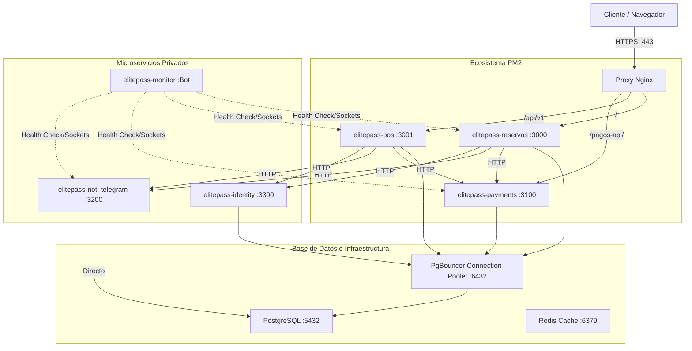

# Diseño de la Arquitectura del Ecosistema ElitePass

## Topología de Red y Mapeo de Puertos

El ecosistema **ElitePass** se encuentra unificado y estandarizado en la máquina virtual `VM00-Reservas-v1` (Azure Ubuntu 24.04 ARM64 Ampere Nativo, 2 Cores dedicados, 3.8 GiB RAM).

### Tabla de Puertos y Procesos Activos

| Aplicación / Servicio | Puerto | Proceso PM2 | Database / Esquema | Responsabilidad |
|---|---|---|---|---|
| **elitepass-reservas** | 3000 | `elitepass-reservas` (Cluster, 2 workers) | `jet_club_db` (public) | Gestión de reservas, fidelización y portal público. |
| **elitepass-pos** | 3001 | `elitepass-pos` (Fork) | `elite_pass_db` (public) | ERP y Punto de Venta de barras y caja en barras. |
| **elitepass-payments** | 3100 | `elitepass-payments` (Fork) | `elitepass_payments` (public) | Pasarela de cobro QR (BCP/BNB) y facturación SIAT. |
| **elitepass-noti-telegram** | 3200 | `elitepass-noti-telegram` (Cluster) | `jet_club_db` (telegram) | Envío de notificaciones push vía Telegram. |
| **elitepass-identity** | 3300 | `elitepass-identity` (Fork) | `elitepass_identity` (public) | Centralización de Auth, BetterAuth y Passkeys. |
| **elitepass-monitor** | — | `elitepass-monitor` (Fork) | — (Memory / OS) | Bot de monitoreo de recursos y estado de PM2. |
| **PostgreSQL 16** | 5432 | `postgresql` (Systemd) | Todas las DBs físicas | Persistencia de datos. |
| **PgBouncer** | 6432 | `pgbouncer` (Systemd) | Reenvío a Postgres | Pooler de conexiones en modo transacción. |
| **Redis 7** | 6379 | `redis-server` (Systemd)| — (Memoria caché) | Caché de rate limits y WebSockets. |

---

## Interacciones entre Componentes

### 1. Pasarela de Pagos (Z-01)
- **Reservas / POS** envían un `POST /api/v1/payments/qr` firmado con `X-App-Key` al microservicio `elitepass-payments` (puerto 3100).
- `elitepass-payments` genera el código QR interactuando con las APIs de los bancos bolivianos (BCP o BNB) y guarda el pago como `PENDING`.
- Al recibir la confirmación por webhook del banco, `elitepass-payments` genera la factura SIAT si está habilitada, actualiza el estado a `PAID` y emite un **callback firmado con HMAC-SHA256** a la app origen para confirmar la orden.

### 2. Notificaciones Telegram (Z-02)
- El bot permite vincular el `chatId` de un usuario al registrar su número telefónico.
- Las aplicaciones realizan peticiones a `POST /api/v1/notifications/send` del microservicio `elitepass-noti-telegram` (puerto 3200) incluyendo el número de celular del destinatario y el mensaje (HTML soportado).
- El microservicio consulta la base de datos `jet_club_db` en el esquema `telegram` para buscar la suscripción activa y envía el mensaje por Telegram.

### 3. Servicio de Identidad e Inicio de Sesión (Z-03)
- El microservicio central `elitepass-identity` en el puerto 3300 maneja las credenciales FIDO/WebAuthn y la autenticación federada.
- Las aplicaciones consultan la API de identidad mediante `X-App-Secret` para verificar usuarios, UPNs (Azure AD) e insertar logs de auditoría en la tabla `AuditEvent`.

---

## Mecanismos de Seguridad y Rendimiento

### Seguridad
- **Multi-Tenancy Guard:** Aislamiento estricto de datos por tenant (`organizationId` / `empresaId`) a nivel de consulta Prisma.
- **Biometría (Passkeys / WebAuthn):** Inicio de sesión biométrico integrado nativamente mediante `@simplewebauthn`.
- **Cifrado AES-256-GCM:** Cifrado en base de datos para credenciales bancarias de comercios.
- **Headers de Seguridad y CSP:** Nginx y los middlewares de Next.js inyectan directivas estrictas de CSP (usando UUID nonces) y headers HSTS (`max-age=63072000; includeSubDomains; preload`).

### Rendimiento y Base de Datos
- **PgBouncer en Modo Transacción:** Optimiza la persistencia reduciendo la fatiga de conexiones concurrentes debido a la naturaleza Serverless de las Server Actions de Next.js.
- **Optimizaciones de Imagen:** Conversión automática a formato WebP/AVIF en el almacenamiento de blobs de Azure para reducir pesos entre 60% y 80%.
- **Nginx Brotli & Gzip:** Comprime los recursos de frontend dinámicos antes del transporte de red.
