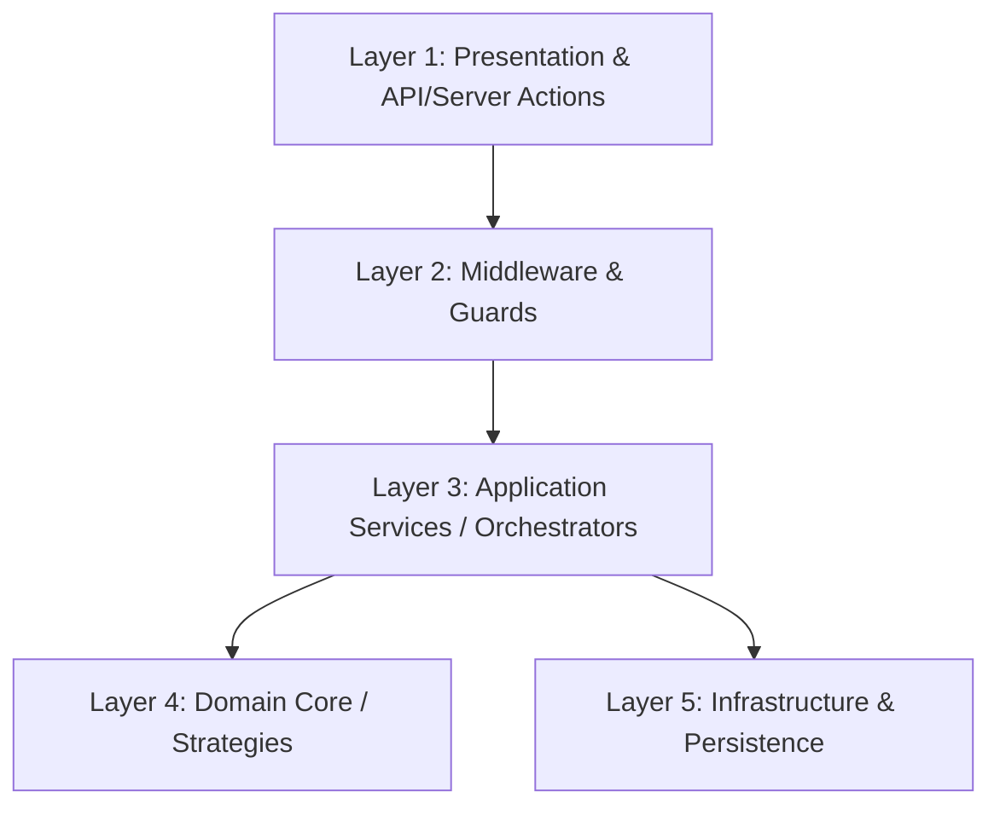

# Design & Architecture: System Upgrades and Integration Plan

This document details the technical design for deploying Redis-based locks, batch/FIFO inventory tracking, Cloudflare Turnstile bot verification, and supplier packaging mappings.

---

## 1. Segregation of Code Layers

To ensure maintainability, testing, and independent scalability of these features, we enforce a strict **5-layer architectural segregation** across both `elitepass-pos` and `elitepass-reservas`:



### Layer 1: Presentation & API/Server Actions
- **Responsibilities**: Render UI elements (e.g., Turnstile widgets, inventory forms); parse and validate incoming payloads; route to backend handlers.
- **Rules**: Zero database access. No business rules logic. Strictly handles HTTP requests/responses or Next.js Server Action inputs.

### Layer 2: Middleware & Guards
- **Responsibilities**: Cross-cutting security concerns (Authentication via SSO, CSRF protection, Nginx/Redis Rate Limiting, Turnstile validation).
- **Rules**: Blocks unauthorized/bot requests before application services are executed.

### Layer 3: Application Services / Orchestrators
- **Responsibilities**: Coordinate workflows. Inject appropriate strategies, run transactions, call external APIs, and dispatch notifications.
- **Examples**: `ReservationService` (locks and registers bookings), `InventoryService` (manages FIFO/FEFO stock adjustments).

### Layer 4: Domain Core / Strategies
- **Responsibilities**: Pure business logic (e.g., FIFO queueing algorithm, unit packaging converters, expiration checks).
- **Rules**: Must be **framework-agnostic** and **database-agnostic**. No Prisma imports, no Redis imports. Accepts pure objects/interfaces and returns result structures.

### Layer 5: Infrastructure & Persistence
- **Responsibilities**: DB communication (Prisma), Cache/Memory Store access (Redis client), Cloud Storage (Azure Blob SDK), HTTP clients for Turnstile siteverify.
- **Rules**: Implements interfaces defined by the Application Services.

---

## 2. Redis-Based Concurrency Lock Engine

### Rationale
Currently, ElitePass uses a PostgreSQL table `ReservationLock` to prevent double-booking of tables or tickets. Under peak concurrency (e.g., ticket release at 8 PM), concurrent database write locks degrade query performance. In-memory locking with Redis offers sub-millisecond check-and-set latencies.

### Multi-Tenant Lock Key Structure
To guarantee tenant isolation, all locks are namespaced with the tenant's `empresaId`:
```
tenant:{empresaId}:lock:{lockType}:{resourceId}
```
- Example for VIP Table 12: `tenant:empresa_abc:lock:table:12`
- Example for Ticket Category "General": `tenant:empresa_abc:lock:ticket_cat:general`

### Locking Algorithm
- **Mechanism**: Atomic check-and-set using Redis `SET key value NX PX milliseconds`.
- **NX**: Set the key only if it does not already exist.
- **PX**: Expire the key after a configured TTL (e.g., 600,000 ms / 10 minutes) to prevent deadlock if a client crashes.
- **Release**: Handled via an atomic Lua script comparing the lock value (uuid generated by the locking client) before deleting:
  ```lua
  if redis.call("get", KEYS[1]) == ARGV[1] then
      return redis.call("del", KEYS[1])
  else
      return 0
  end
  ```

### Phased Zero-Downtime Rollout Strategy
We will employ a **phased database bypass** using an environment-controlled feature flag:

```
[Phase 1: Dual-Write, Pg Read] ──> [Phase 2: Dual-Write, Redis Read] ──> [Phase 3: Redis-Only, SQL Async Log] ──> [Phase 4: Drop SQL Table]
```

1. **Phase 1: Dual-Write & Compare (Legacy Active)**
   - Lock requests are written to both Postgres (`ReservationLock` table) and Redis.
   - The application relies solely on the Postgres result to determine if the lock was successful.
   - Out-of-sync discrepancies are logged to the audit queue for monitoring.
2. **Phase 2: Dual-Write & Redis-First Read (Redis Active with SQL Fallback)**
   - The application writes to both but reads and decides based on Redis.
   - If Redis fails, or if there is a cache miss, the system queries the `ReservationLock` table as a fallback.
3. **Phase 3: Redis-Only with Postgres Async Archiving**
   - The Postgres `ReservationLock` table is bypassed during the reservation path.
   - Locks are strictly managed in Redis. Upon successful reservation completion, a record is written asynchronously to `ReservationLock` (or audit log) for transactional archiving.
4. **Phase 4: Schema Deprecation**
   - After a 30-day stability verification, the `ReservationLock` table is dropped from the database schema during a minor patch update.
- **Rollback Option**: Setting `USE_REDIS_LOCKS=false` reverts the engine to the standard PostgreSQL implementation instantly.

---

## 3. Batch/FIFO Inventory System

### Rationale
ElitePass POS tracks stock totals. To support high-end liquor expiration, trackability, and cost auditing, we must track stock in specific batches (Lotes) and consume them in a FIFO (First-In, First-Out) or FEFO (First-Expired, First-Out) order.

### Database Schema Expansion (Non-Breaking)
To preserve existing tables, we add new models as a separate relation without breaking current fields:

```prisma
// New Model for Batch Tracking
model LoteProducto {
  id                String       @id @default(cuid())
  empresaId         String
  productoId        String
  codigoLote        String       // e.g. "LOT-2026-06-A"
  cantidadOriginal  Decimal      @db.Decimal(10, 2)
  cantidadRestante  Decimal      @db.Decimal(10, 2)
  fechaExpiracion   DateTime?
  costo             Decimal      @db.Decimal(10, 2)
  fechaIngreso      DateTime     @default(now())
  
  // Relations
  producto          Producto     @relation(fields: [productoId], references: [id])
  kardexMovements   KardexLote[]

  @@unique([empresaId, productoId, codigoLote])
  @@index([empresaId, productoId, fechaExpiracion])
  @@index([empresaId, productoId, fechaIngreso])
}

// Ledger mapping movements back to specific batches
model KardexLote {
  id             String       @id @default(cuid())
  loteId         String
  cantidad       Decimal      @db.Decimal(10, 2)
  tipoMovimiento String       // "VENTA", "COMPRA", "MERMA", "AJUSTE"
  fecha          DateTime     @default(now())

  lote           LoteProducto @relation(fields: [loteId], references: [id])
}
```

### Strategy Pattern for Stock Consumption
An interface `IInventoryConsumptionStrategy` is implemented by `FifoStrategy` and `FefoStrategy`:
- **FEFO (First-Expired, First-Out)**: Queries `LoteProducto` filtering out expired lots, sorted by `fechaExpiracion ASC`.
- **FIFO (First-In, First-Out)**: Queries `LoteProducto` sorted by `fechaIngreso ASC`.

### Phased Zero-Downtime Rollout Strategy
1. **Phase 1: Add Tables & Triggers**
   - Apply Prisma migrations to create `LoteProducto` and `KardexLote`.
   - Legacy `Producto.stock` continues to be the source of truth for stock counts.
2. **Phase 2: Shadow Ingestion & Reconciliation**
   - When a purchase is registered, the system inserts the quantity into the legacy `Producto.stock` AND creates a default `LoteProducto` record.
   - When a sale happens, it decrements `Producto.stock` AND consumes `LoteProducto` asynchronously in the background via a queue.
   - A nightly reconciliation script compares `Producto.stock` with `SUM(LoteProducto.cantidadRestante)` per product, logging details on any drift.
3. **Phase 3: Seed Historic Stock**
   - For products that have existing stock but no batch assigned, run a seed script to create a placeholder batch `LOT-LEGACY` containing the current stock value.
4. **Phase 4: Invert Source of Truth**
   - Switch the POS inventory reading to sum up remaining batches (`SUM(cantidadRestante)`).
   - `Producto.stock` column is deprecate-marked and updated asynchronously solely as a query-performance cache.

---

## 4. Turnstile Verification Wrapper

### Rationale
Bots like `shiyutim/tickets` fetch authentication cookies and target backend API endpoints (e.g. reservation creations) directly, bypassing frontend forms.

### Architecture Flow
1. **Frontend**: The user fills in details and solves the Cloudflare Turnstile widget. The widget outputs a `token`.
2. **Request Submission**: The frontend passes this token via the header `X-Turnstile-Token` or within the Server Action parameters.
3. **Guard Interception**:
   ```typescript
   async function verifyTurnstileToken(token: string, clientIp: string): Promise<boolean> {
     const secret = process.env.TURNSTILE_SECRET_KEY;
     const response = await fetch("https://challenges.cloudflare.com/turnstile/v0/siteverify", {
       method: "POST",
       body: JSON.stringify({ secret, response: token, remoteip: clientIp }),
       headers: { "Content-Type": "application/json" }
     });
     const data = await response.json();
     return data.success;
   }
   ```
4. **Action Execution**: If verification succeeds, the execution proceeds. If not, the Server Action returns an authorization error.

### Segregation & Zero-Downtime Rollout
- **Segregation**: Turnstile verification is wrapped inside an API middleware decorator: `withTurnstileProtection(actionFn)`.
- **Zero-Downtime**: 
  - Deploy the backend verification logic first with `TURNSTILE_ENFORCED=false`. It logs warnings when tokens are missing or invalid, but allows the request to pass.
  - Deploy the frontend Turnstile component.
  - Check the log analysis to ensure no real users are blocked due to loading delays.
  - Set `TURNSTILE_ENFORCED=true` to block unverified requests.

---

## 5. Supplier Packaging Mappings

### Rationale
InvenTree maps an internal `Part` to external `SupplierParts` that contain packaging ratios. We introduce a similar mapping to support buying by the box/keg but selling/tracking inventory by the bottle/ounce.

### Database Schema Additions
```prisma
model SupplierProduct {
  id                 String       @id @default(cuid())
  empresaId          String
  proveedorId        String
  productoId         String
  skuProveedor       String       // Supplier SKU
  precioCompra       Decimal      @db.Decimal(10, 2)
  unidadEmbalaje     String       // e.g. "CAJA", "BARRIL"
  ratioConversion    Decimal      @db.Decimal(10, 2) // e.g. 12 (1 caja = 12 botellas)

  // Relations
  proveedor          Proveedor    @relation(fields: [proveedorId], references: [id])
  producto           Producto     @relation(fields: [productoId], references: [id])

  @@unique([empresaId, proveedorId, skuProveedor])
  @@index([empresaId, productoId])
}
```

### Segregation and Zero-Downtime
- **Domain Layer**: A `PackagingConverter` maps:
  `BaseStockUnits = PurchasedQuantity * ratioConversion`
- **Application Layer**: When registering a purchase from a supplier:
  1. Retrieve `SupplierProduct` mapping.
  2. If found, automatically translate the units and cost.
  3. Create the `LoteProducto` using the translated base units.
- **Rollout**: Introduce `SupplierProduct` as an optional table. Purchases can still be recorded using base units directly (fallback logic) to avoid breaking existing import scripts or legacy purchase histories.
