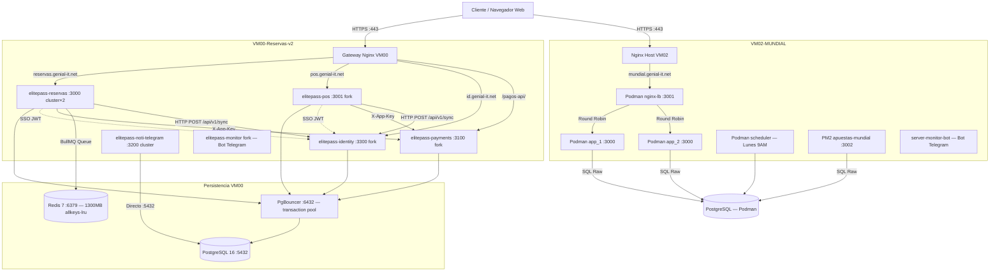
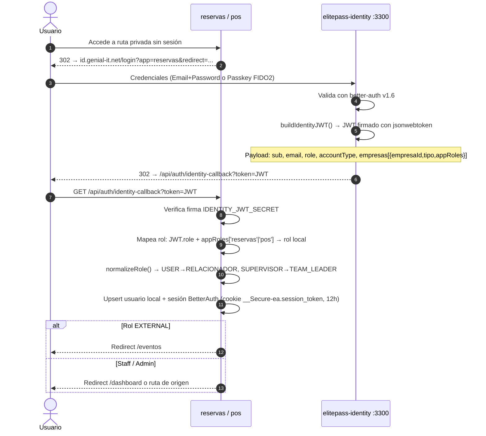
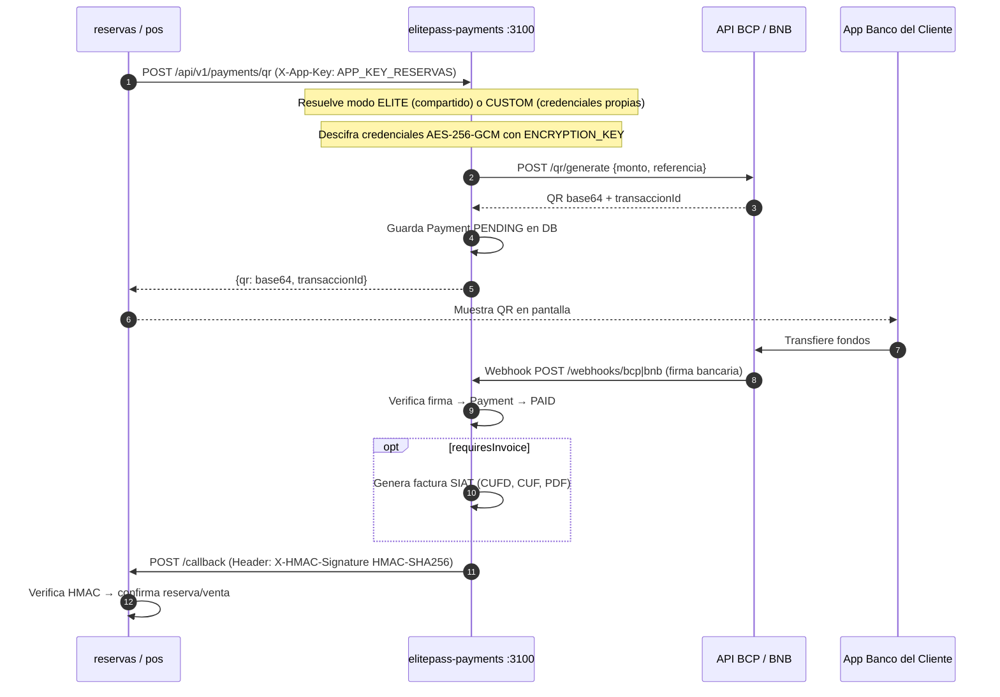
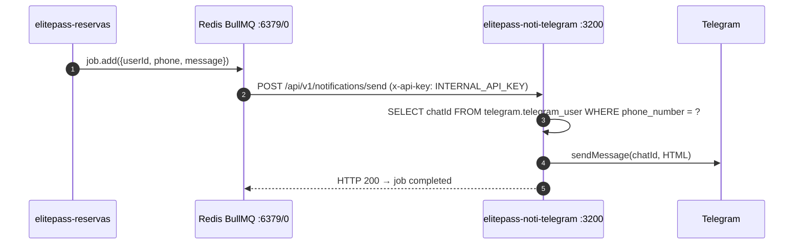
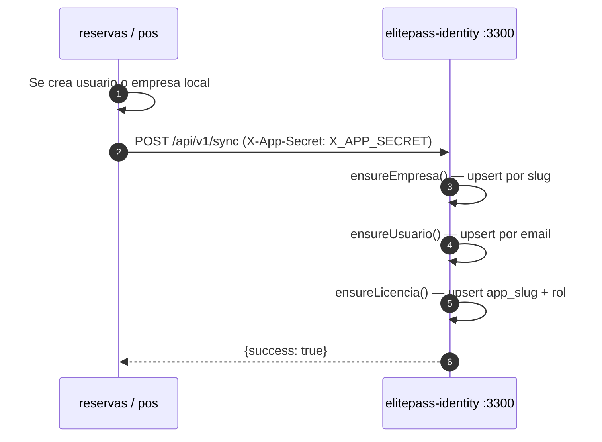

# Antigravity Ecosistema: Especificación de Arquitectura Global

Topología de red, integración, interacciones y flujo de datos de la suite **Antigravity** (ElitePass) desplegada en los servidores `VM00-Reservas-v2` y `VM02-MUNDIAL`.

---

## 1. Core Técnico y Arquitectura

El ecosistema sigue una filosofía de **Monolito Modular Híbrido con Microservicios Asíncronos** en VM00 y un **Runtime Contenerizado de Alta Disponibilidad** en VM02. La filosofía "gravedad cero" prioriza la simplicidad operativa: desacoplar los servicios de alto impacto (pagos, autenticación, notificaciones) sin la fricción de una orquestación de microservicios distribuidos compleja.

### Inventario de Servidores

| Atributo | VM00-Reservas-v2 (Principal) | VM02-MUNDIAL |
|---|---|---|
| **OS** | Ubuntu 24.04.4 LTS ARM64 | Ubuntu 24.04.4 LTS x86_64 |
| **Hostname** | VM00-Reservas-v2 | VM02-MUNDIAL |
| **IP Privada** | 10.0.0.4 | 10.0.0.7 |
| **IP Pública** | 20.33.29.53 | — |
| **Región Azure** | EastUS (ARM Ampere) | — |
| **SSH** | Puerto 5001 | Puerto 5001 |
| **RAM** | 7.7 GB | 3.8 GB |
| **Disco** | 29 GB (~7.3 GB usados) | 29 GB (~18 GB usados, 63%) |
| **Node.js** | v24.13.0 ARM64 (NVM) | v22.22.3 (npm) |
| **Package Manager** | pnpm 11.1.3 | npm |
| **Orquestación** | PM2 | PM2 + Podman |

### Diagrama de Bloques Global



### Procesos PM2 en VM00

| ID | Nombre | Modo | Puerto | Heap Limit |
|----|--------|------|--------|------------|
| 3, 4 | elitepass-reservas | cluster ×2 | 3000 | 1024 MB × 2 |
| 5 | elitepass-pos | fork | 3001 | 384 MB |
| 6 | elitepass-payments | fork | 3100 | 256 MB |
| 7 | elitepass-identity | fork | 3300 | 512 MB |
| 2 | elitepass-noti-telegram | cluster | 3200 | — |
| 1 | elitepass-monitor | fork | — (bot polling) | — |

### Pilares Arquitectónicos

1. **SSO Centralizado (elitepass-identity):** Aísla la complejidad WebAuthn/Passkeys + credenciales en un único IdP. Emite JWTs firmados con `IDENTITY_JWT_SECRET` (via `jsonwebtoken`) que contienen `sub`, `email`, `role`, `empresas[]` con `appRoles` por empresa.
2. **HotSync Idempotente (`POST /api/v1/sync`):** Apps satélite notifican a Identity en cada creación de usuario/empresa usando el header `X-App-Secret`. Identity ejecuta `ensureEmpresa()` + `ensureUsuario()` + `ensureLicencia()` de forma idempotente.
3. **Desacoplamiento Asíncrono (Redis + BullMQ):** Notificaciones, auditoría y puntos de fidelización se procesan en colas con reintentos automáticos, nunca bloqueando el request HTTP.
4. **Multi-Tenant Guard en Datos:** Filtro `organizationId` / `empresaId` forzado en cada Server Action y resolver Prisma. Ninguna consulta retorna datos de otra organización.

---

## 2. Capa de Datos y Persistencia

### Bases de Datos PostgreSQL 16 (VM00)

| Base de Datos | App Propietaria | Conexión | Propósito |
|---|---|---|---|
| `jet_club_db` | elitepass-reservas | PgBouncer :6432 | Eventos, reservas, tickets, fidelización, vouchers |
| `jet_club_db` (schema telegram) | elitepass-noti-telegram | Directo :5432 | Mapeo celular ↔ Telegram chatId |
| `elite_pass_db` | elitepass-pos | PgBouncer :6432 | Ventas, stock, barras, arqueos, traspasos |
| `elitepass_payments` | elitepass-payments | PgBouncer :6432 | Credenciales cifradas AES-256, pagos QR, facturas SIAT |
| `elitepass_identity` | elitepass-identity | PgBouncer :6432 | Usuarios maestros, passkeys, empresas, membresías, audit log |

### PgBouncer (Transaction Pool)

- Puerto: `6432`
- Modo: **transaction** — compatible con Prisma via `?pgbouncer=true&connection_limit=5`
- **Excepción:** `elitepass-noti-telegram` usa conexión directa al puerto 5432 con `?schema=telegram` porque gestiona su propio pool mínimo.

### Redis 7

- Puerto: `6379`
- `maxmemory 1300mb` con política `allkeys-lru`
- Base `0`: BullMQ de reservas (notificaciones, auditoría, puntos)
- Base `1`: POS (caché operativa)

---

## 3. Flujos de Integración Clave

### Flujo SSO — Login y Callback



### Flujo Pago QR con Callback HMAC



### Flujo Notificaciones Telegram (Asíncrono)



### Flujo HotSync Satélite → Identity



---

## 4. Mecanismos de Seguridad e Hardening

### Stack de Seguridad en VM00

| Capa | Tecnología | Configuración |
|---|---|---|
| **Firewall perimetral** | iptables + ipset | Geoblock Multiport (80, 443, 5001): Solo Bolivia, Cloudflare, Azure, AWS y Google |
| **IDS/IPS** | CrowdSec 1.7.8 | Escenarios activos: SSH brute-force, web exploits, scanners |
| **WAF/Proxy** | Nginx 1.24 | Rate limiting por zonas, Brotli, Gzip, HTTP/2, proxy_cache |
| **Credenciales** | bcrypt rounds=12 | Estándar en todo el ecosistema — hash generado siempre desde Node.js, nunca shell |
| **Secretos** | .env — nunca en git | `.env.*`, `authorized-users.json`, `*.pem`, `*.key` excluidos de todos los repos |
| **SSH** | Puerto 5001 | `PasswordAuthentication yes` (pendiente migrar a authorized_keys only) |

### Dominios y TLS

| Dominio | App | Puerto Interno |
|---|---|---|
| `reservas.genial-it.net` | elitepass-reservas | 3000 |
| `pos.genial-it.net` | elitepass-pos | 3001 |
| `id.genial-it.net` | elitepass-identity | 3300 |
| `mundial.genial-it.net` | apuestas-mundial-2026 | 3001 (Podman nginx-lb) |

SSL en `/etc/nginx/ssl/`. HTTP/2 habilitado. Brotli + Gzip nivel 6 en assets estáticos.

---

## 5. Despliegue

### Comandos de Deploy por App (VM00)

```bash
# elitepass-reservas (Next.js — requiere build)
cd /home/soporte/elitepass-reservas
nice -n 15 pnpm build && pm2 restart elitepass-reservas && git push danny main

# elitepass-identity (Next.js — requiere build)
cd /home/soporte/elitepass-identity
pnpm build && pm2 restart elitepass-identity

# elitepass-pos (Vite frontend + tsx backend — NO requiere build de backend)
cd /home/soporte/elitepass-pos/frontend
node_modules/.bin/vite build
pm2 restart elitepass-pos

# elitepass-payments (tsx — NO requiere build)
pm2 restart elitepass-payments

# elitepass-noti-telegram (tsx — NO requiere build)
pm2 restart elitepass-noti-telegram
```

### Sincronización de Conocimiento (Skills)

```
GitHub (danny9001/skill-elite-pass-knowledge)  ← Fuente de verdad
    ↑
    ├── (edición activa) VM00: /home/soporte/elitepass-monitor/openspec/skills/
    ↓
    └── (pull diario 4:05 AM) VM02: /home/soporte/skill-elite-pass-knowledge/
```

---

> **Referencia:** Para detalles de código, variables de entorno y esquema de base de datos de cada app, consultar su documento técnico en esta carpeta.
